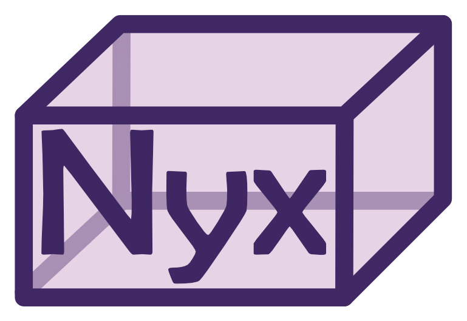

# Nyx

[](https://github.com/BoccaraLab/nyx/actions/workflows/tests.yml)
[](LICENSE)
[](pyproject.toml)

Nyx is a flexible framework for sleep scoring across species, lifespan and modalities.

Nyx separates wake from sleep using EMG power, then splits sleep into stages by
clustering a PCA of the EEG spectrogram. It needs **no training data and no
manually scored examples** — which is what lets it work on species that have no
scoring standard, and on recordings nobody has scored yet.


If you use Nyx, please cite the [preprint](https://www.biorxiv.org/content/10.64898/2026.07.24.740558v1).

---

## System requirements

**Operating systems.** Any platform with Python 3.10 or newer. Tested on
Windows 11, Ubuntu 22.04 (GitHub Actions `ubuntu-latest`) and macOS 14
(`macos-latest`).

**Python.** 3.10, 3.11 and 3.12 are tested on every commit.

**Hardware.** None beyond an ordinary desktop or laptop. No GPU. Memory scales
with the recording: a 12 h mouse recording at 200 Hz scores comfortably in
8 GB. The figures below were measured on a laptop with a 13th-generation Intel
Core i9-13900H and 32 GB of RAM.

**Dependencies.** Installed automatically by `pip`; minimum versions are in
[`pyproject.toml`](pyproject.toml). The versions the results below were
produced with:

| | | | |
|---|---|---|---|
| numpy 2.5.1 | pandas 3.0.5 | scipy 1.18.0 | scikit-learn 1.9.0 |
| matplotlib 3.11.1 | hdbscan 0.8.44 | spikeinterface 0.104.8 | mne 1.12.1 |
| pyedflib 0.1.42 | PySide6 6.11.1 | ephyviewer 1.8.0 | pyqtgraph 0.14.0 |

The last three are needed only for the GUI.

## Installation guide

```bash
git clone https://github.com/BoccaraLab/nyx.git
cd nyx
conda create -n nyx python=3.12 -y
conda activate nyx
pip install -e ".[notebooks]"
```

Optional extras: `gui` for the scoring window, `notebooks` for the examples,
`interactive` for the matplotlib tools outside a notebook, and `full` for all
three.

```bash
pip install -e ".[full]"
```

**Typical install time:** about **8 minutes** on a normal desktop with a cold
pip cache and an ordinary broadband connection — most of it downloading and
building scipy, scikit-learn, spikeinterface, mne and Qt. The smaller
`.[notebooks]` install is quicker; a warm cache brings either under a minute.

## Demo

```bash
python examples/run_demo.py
```

No downloads and no data access: the recording is simulated in memory by
`nyx.demo_recording()`. The demo scores a clean synthetic recording, then
repeats the exercise on one carrying mains interference and saturated signal at
both ends — showing the signal check finding both problems and what fixing them
is worth.

**Expected output**, printed at the end:

```
  clean recording                        MF1 0.996
  messy recording, nothing fixed         MF1 0.897
  messy recording, notch + trim applied  MF1 0.995
```

It also writes 33 files to `examples/demo_output/` — `hypnogram.csv`,
`wake_sleep.csv`, `run.json` and a `plots/` folder for each of the two runs.
Start with `plots/summary.png`.

**Expected run time:** about **1 minute** on a normal desktop.

Or from Python:

```python
import nyx

recording, reference = nyx.demo_recording()
result = nyx.score_recording(recording, nyx.demo_params(), reference=reference)
print(result.agreement.summary())
```

Good for checking an installation and for following the tutorial. **Not** a
measure of how well Nyx works — the signal is synthesised to contain exactly
the structure Nyx looks for, so it scores near-perfectly by construction. Real
EEG is far messier. For an honest assessment, run one of the public datasets
below.

## What a run produces

`save_results` writes the hypnogram, the run record, and a figure covering the
whole run — EMG threshold, PCA components, clusters, per-cluster spectra, time
per stage, confusion matrix and hypnogram — plus each panel separately.

The per-cluster spectra are the panel worth checking every time: NREM should
carry more low-frequency power than REM, and if it does not, the stage
assignment is wrong however clean the clusters look.

Agreement is reported as **MF1**, the unweighted mean of the per-stage F1
scores. Unweighted on purpose: REM is a small fraction of any recording, so
weighting by duration lets good WAKE/NREM performance hide a method that misses
REM entirely.

## Instructions for use

To score your own recording:

```python
import nyx

recording = nyx.read_recording("mouse01.edf", eeg_channel=0, emg_channel=1)
print(recording.describe())         # check you picked the right channels

params = nyx.load_params("mouse")
result = nyx.score_recording(recording, params)
nyx.save_results(result, "results/mouse01")
```

That writes `hypnogram.csv` and a `run.json` recording every decision made.

A manually scored reference is **optional**. Pass one only if you have it and
want agreement metrics:

```python
reference = nyx.read_annotations("mouse01_scores.csv", format="epoch_csv",
                                 epoch_length=4,
                                 label_map={1: "WAKE", 2: "NREM", 3: "REM"})
result = nyx.score_recording(recording, params, reference=reference)
print(result.agreement.summary())
```

## Notebooks

In [`examples/`](examples/). The first two need **no data at all**:

| | needs | covers |
|---|---|---|
| [`01_score_recording`](examples/01_score_recording.ipynb) | nothing | one recording step by step, and the four decisions that are yours |
| [`02_signal_check`](examples/02_signal_check.ipynb) | nothing | mains interference and artefacts, and what fixing them is worth |
| [`03_score_rodents`](examples/03_score_rodents.ipynb) | one 78 MB download | a real mouse recording against a ten-expert consensus |
| [`04_score_humans`](examples/04_score_humans.ipynb) | a human PSG | the human pipeline start to end: four steps, five stages, and collapsing to coarser ones |

---

## The GUI

```bash
pip install -e ".[gui]"
nyx-gui --help     # check the install
nyx-gui            # or: nyx-gui --demo
```

| | |
|---|---|
| `nyx-gui recording.edf` | open with that file ready to load |
| `nyx-gui --params mouse` | start from a preset |
| `nyx-gui --config results/m01/run.json` | resume a saved run, decisions and all |
| `nyx-gui --demo` | the synthetic recording, no data needed |

One window, tabs down the side, one tab per decision the notebooks stop at.
Every tab is reachable as soon as its inputs exist, so you can go back and
retune a threshold after seeing the clusters. Each tab shows whether what you
are looking at is current or out of date: change the EMG threshold and
everything downstream is marked stale, but the signal check above it is not.

| tab | the decision |
|---|---|
| Recording | which file, which two channels, which parameters |
| Signal check | the mains notch, and where to start and stop |
| EMG threshold | where the wake/sleep cut goes — **drag it**, on the distribution or on the power trace; they are the same line |
| Sleep stages | components, clustering, and which cluster is REM |
| Result | the scoring against the reference, corrected by hand, and saved |

Every tab is a dock area, so the panels **scroll together and can be
rearranged**: drag one beside another, tab them, or tear one off into its own
window. The traces, spectrograms, component scores and hypnograms are all
ephyviewer views on one clock — scroll the EEG and the EMG power, the PCs and
the hypnogram all follow. The things that are not time series (the cluster
scatter, the per-cluster spectra) are matplotlib, and dock alongside.

Both hypnograms — the wake/sleep split and the final scoring — are editable in
place: `alt`+arrows jump to the next change of stage, `ctrl`+arrows to the next
epoch a postprocessing rule objects to, and those are drawn faded so you can
see them without navigating. Corrections only count once you apply them; from
then on they are what gets saved, and `run.json` records that a person changed
the scoring.

Clusters can also be assigned by hand: draw round a group of points in the
scatter and give them a stage, for the cases clustering will not get on its own.

The GUI runs the same functions the notebooks do — no second implementation.
On the Oxford benchmark it reproduces `03_score_rodents` segment for segment.
Nothing in it is required: the notebooks and `score_recording` are unchanged.

Its views come from [ephyviewer](https://github.com/NeuralEnsemble/ephyviewer),
used as published — the sleep-specific parts (a scalogram in dB, the curation
shortcuts) are subclasses in [`nyx/gui/viewers.py`](src/nyx/gui/viewers.py).

---

## Look at the signal first

Before scoring anything, check what you are working with:

```python
check = nyx.check_signals(recording)     # traces + spectrograms, start and end
check.plot()
print(check.summary())
```

This answers the three questions that come before scoring: is the signal usable,
does it need a notch filter, and where should the analysis window start and end.
Mains interference is measured by `check.suggested_notch()` returns `50`, `60` or `None`.

## Four decision points

Nyx is not a black box, and four points in it are genuine judgement calls. Each
has an automatic default and an explicit override:

| decision | default | override |
|---|---|---|
| analysis window | whole recording | `window=(start, end)` |
| EMG wake/sleep threshold | fitted automatically | `emg_threshold=...` |
| clustering settings | `DEFAULT_CLUSTERING` | the `clustering` params section |
| which cluster is which stage | ordered by spectral content | `cluster_overrides={...}` |

Expect to adjust the last two per recording — that is normal use. Run one recording, look at the EMG histogram and the
per-cluster spectra, and tune.

---

## Your own data

Nyx reads recordings by **format**, not by dataset, so using it on new data
needs no code:

| recordings | annotations |
|---|---|
| `edf` / `bdf` | `interval_csv` — `time,duration,label` |
| `spikeinterface` folders | `epoch_csv` — one row per epoch, any stage coding |
| `npz` | `column_csv` — one column per recording |
| | `nsrr_xml`, `visbrain_hyp`, `epoch_npy`, `epoch_mat` |

Channels are selected by position **or** by name (`eeg_channel="C3_M2"`).
Anything unusual can be registered from your own code — see
`nyx.io.register_recording_reader` and `register_annotation_reader`.

### No EMG?

EMG power is what separates wake from sleep, so losing it costs real accuracy —
mostly in REM, which without it looks much like quiet wake. If the preparation
has two or more wideband channels, build a surrogate from them instead of going
without:

```python
emg = nyx.emg_from_lfp([si.load("lfp/"), si.load("ecog/")])
result = nyx.score_recording(recording, params, emg=emg)
```

Muscle is volume-conducted, so it appears on every electrode at once while
brain activity stays local. Band-passing 275–600 Hz and measuring how much the
channels agree recovers a usable tone signal. Failing that,
`emg_channel=None` with `mouse_no_emg` params scores from the EEG alone —
Nyx will warn, and you should check the per-cluster spectra every time.

### Many recordings

Batches are driven by a CSV, one row per recording:

```csv
recording_path,annotation_path,eeg_channel,emg_channel
data/m01.edf,scores/m01.csv,0,1
data/m02.edf,,0,1
```

Open it as a **queue**, which remembers where you got to:

```python
queue = nyx.open_queue("recordings.csv", params="mouse")
queue.print_status()
```

There are two ways through it, for two different jobs.

**Interactive — scoring a study.** Each recording needs looking at, so the queue
hands them out one at a time and rewrites `config.json` as it goes:

```python
config = queue.next()          # writes config.json, pointing at this recording
# ... run your notebook, adjust the threshold and cluster mapping, save ...
queue.done()                   # or queue.skip("EMG disconnected")
```

The notebook reads that one file and is never edited between recordings:

```python
config = nyx.load_config("config.json")
recording, reference = config.load()
```

`skip` takes a reason, and keeps it — so "why is there no result for m07" still
has an answer next year.

**Headless — reproducing a result.** No interaction, everything as written:

```python
nyx.open_queue("reruns.csv").run_all()
```

Point that at saved `run.json` files and every decision is already recorded, so
nothing is left to choose. Running it on *unseen* recordings scores them on
defaults, which are a starting point rather than an answer — that is what the
interactive loop is for. A recording that fails is recorded as failed with its
error and the batch carries on; one unreadable file should not cost you the
other forty.

Either way, progress survives the session ending. A recording whose output
folder already has a `run.json` counts as scored even if the state file is
gone, so the queue is still right after you delete it, or when a colleague
scored part of the list on another machine.

### Public datasets

Recipes know the folder layout of several public datasets, so you only give a
root and a recording name:

```python
from nyx.datasets import list_datasets, load_dataset

recording, reference = load_dataset("dodh", data_root="/data",
                                    recording_name="0d79f4b1-...")
```

Currently: Oxford mouse benchmark, Gulledge 2025, Sippel, Ellen/Dash, SIESTA,
Boccara lab, Dreem Open Datasets (dodh/dodo), MESA, CHAT, CCSHS, ANPHY-Sleep.

---

## Parameters

A parameter file describes **how to score**, not which recording. It carries the
spectral settings and the sequence of clustering steps, and no paths or
thresholds — so it is shareable. See [`src/nyx/params/README.md`](src/nyx/params/README.md).

```jsonc
"steps": [
  { "name": "wake_sleep",  "method": "emg_threshold" },
  { "name": "split_sleep", "within": "SLEEP", "method": "hdbscan",
    "n_pcs": 4, "stage_order": ["REM", "NREM"] }
]
```

`score_recording` runs this list, so going finer is a matter of adding a step
rather than writing code. `mouse_substages.json` adds a third that subdivides
NREM into NREM2, NREM3 and TR (transition); `human.json` runs four to reach five
stages. `nyx.collapse(hypnogram, 3)` folds any of it back to WAKE/NREM/REM, so a
substage run stays comparable against an ordinary three-stage reference.

Shipped defaults: `mouse.json`, `mouse_weak_emg.json` (when the EMG does not
separate cleanly), `rat.json`, `human.json`.

An optional `postprocess` list rewrites implausible *sequences* after the
scoring — REM straight out of wake, segments too short to be a real bout. It is
off by default: those rules barely move agreement but they do move the biology,
so which one to use depends on what your analysis measures. See
[`nyx/postprocess.py`](src/nyx/postprocess.py) and `src/nyx/params/README.md`.

## Reproducibility

Every run writes a `run.json` holding the parameters **inline** plus every
decision — window, thresholds, cluster mappings, refinement thresholds. Loading
it re-runs the scoring exactly, with nothing left to decide:

```python
config = nyx.load_config("results/mouse01/run.json")
```

Cluster ids are renumbered by spectral content, so a saved mapping means the same thing on every
run. Without that, replaying saved parameters can attach stage names to the
wrong clusters.

### Reproducing the paper

The datasets in the manuscript are public; where each one comes from is listed
in [`examples/README.md`](examples/README.md), and Nyx ships a **recipe** for
each, so a dataset needs a root directory and a recording name and nothing
else:

```python
from nyx.datasets import list_datasets, load_dataset
recording, reference = load_dataset("dodh", data_root="/path/to/data",
                                    recording_name="...")
```

[`examples/03_score_rodents.ipynb`](examples/03_score_rodents.ipynb) reproduces
a single recording of the Oxford mouse benchmark end to end, against its
ten-expert consensus, and [`04_score_humans.ipynb`](examples/04_score_humans.ipynb)
does the same for a human PSG.

The analysis code that produces the manuscript's figures and tables is being
refactored to use this package and will be deposited separately; it is not part
of this repository.

---

## Tests

```bash
pip install -e ".[dev]"
pytest -m "not gui"        # the library
```

The suite runs on synthetic signals with a known hypnogram, so it needs no data.

The GUI tests need a Qt binding and run offscreen:

```bash
pip install -e ".[full,dev-gui]"
pytest                     # everything
```

`pytest-qt` is in `dev-gui` rather than `dev` on purpose: it refuses to start
when no Qt binding is importable, so having it in `dev` would stop a Qt-free
checkout running even the library tests.

## Citing

Signorelli L, Korchynska S, Ortiz C, Arena A, Wilhelm S, Boccara C. *Nyx: a
flexible framework for sleep scoring across species, lifespan and modalities.*
bioRxiv 2026. doi:[10.64898/2026.07.24.740558](https://doi.org/10.64898/2026.07.24.740558)

Machine-readable metadata is in [`CITATION.cff`](CITATION.cff); contributors are
listed in [`AUTHORS.md`](AUTHORS.md).

## Licence

Copyright © C. Boccara Lab.

GNU Lesser General Public License v3.0 or later — see [`LICENSE`](LICENSE),
which incorporates the [GPL-3.0](https://www.gnu.org/licenses/gpl-3.0.txt) by
reference.
